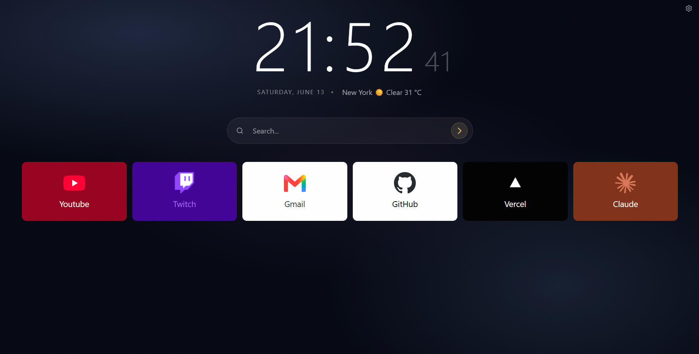
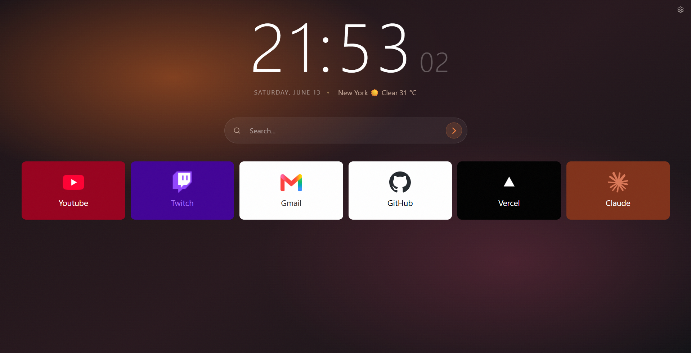

# Nova Tab

A customizable Chrome new tab extension built with Vue, TypeScript, Vite, and CRXJS.

Nova Tab replaces the default new tab page with a focused dashboard: clock, date, weather, search, draggable shortcuts, themes, custom wallpapers, and English/Russian localization.

<table>
  <tr>
    <td></td>
    <td></td>
  </tr>
</table>

## Features

- Clean new tab dashboard with clock, date, weather and shortcuts
- Chrome search integration
- Draggable shortcut grid
- Shortcut groups with drag-and-drop organization
- Automatic favicon fetching with manual refresh
- Custom shortcut icons and colors
- Custom theme
- Settings stored locally with `chrome.storage.local`
- Icon and custom wallpaper cache stored in IndexedDB

## Tech Stack

- Vue 3.5
- TypeScript
- Vite
- CRXJS
- Tailwind CSS
- shadcn/ui-style components
- dnd-kit
- IndexedDB via `idb`

## Requirements

- Node.js
- pnpm
- Chromium-based browser for extension testing

## Getting Started

Install dependencies:

```bash
pnpm install
```

Start the Vite dev server:

```bash
pnpm run dev
```

Build the extension:

```bash
pnpm run build
```


## Loading in Chrome

1. Run `pnpm run build`.
2. Open `chrome://extensions/`.
3. Enable Developer mode.
4. Click Load unpacked.
5. Select the generated `dist` directory.
6. Open a new tab.


## Notes

- The extension overrides Chrome's new tab page through `chrome_url_overrides`.
- Weather data is fetched from Open-Meteo.
- Address search uses Nominatim.
- Favicons are fetched from external site/icon sources, so unavailable sites may fail to provide an icon.
